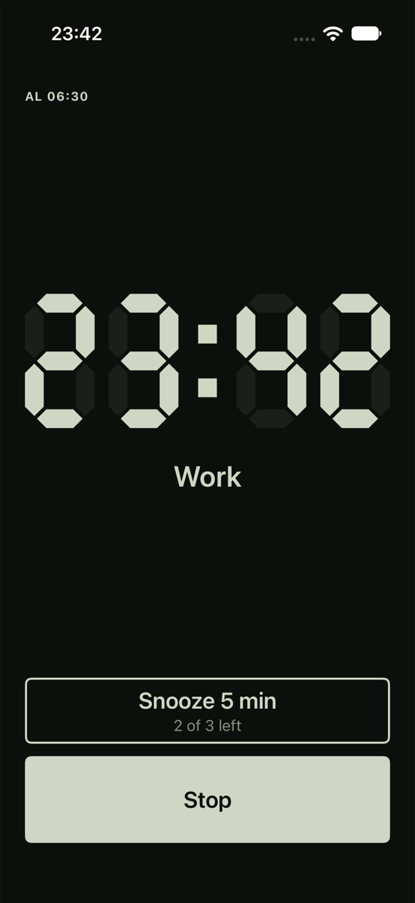
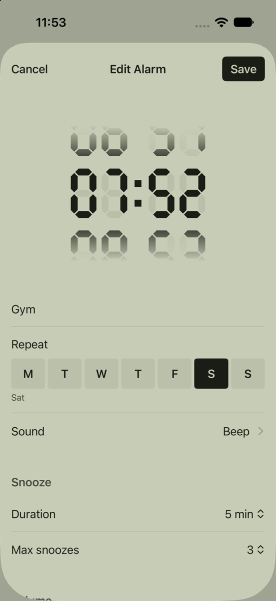
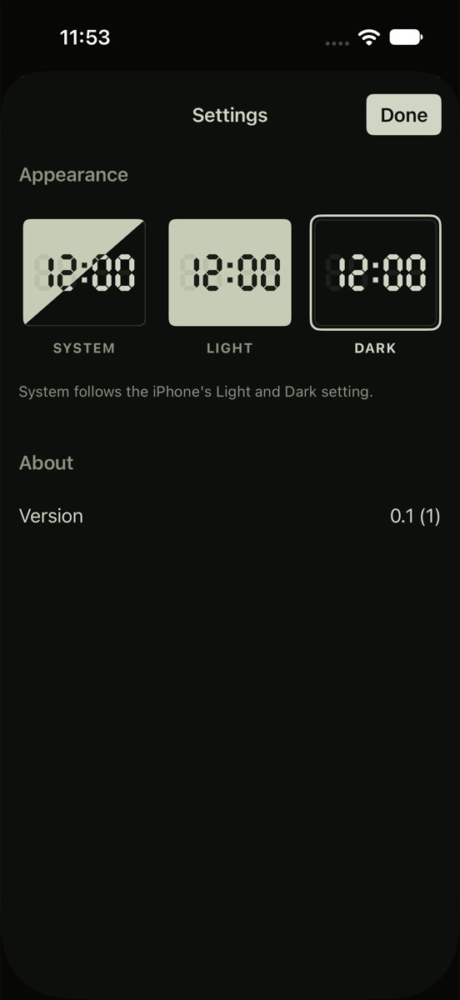

# 7seg

An open-source alarm clock for iPhone that you can't turn off in your sleep.

Some people get so used to silencing their alarm that they do it without waking up. Slide to stop, roll over, wake up an hour late. 7seg is for them.

Snooze and Stop only exist inside the app. If you slide Stop on the lock screen, press the side or volume buttons, or swipe the app away, the alarm comes back about two seconds later. It keeps coming back until you open the app and stop it there, and by then you're usually awake.

An alarm also has to actually ring, so 7seg schedules everything through AlarmKit, Apple's system alarm API. Alarms ring through Silent mode and Focus and show full-screen on the lock screen.

The look comes from an old LCD alarm clock without a backlight: 7-segment digits with the unlit segments still faintly visible, in light and dark mode.

<p align="center">
  
  &nbsp;
  
  &nbsp;
  
</p>

> Early days: version 0.1, not on the App Store or TestFlight yet. Large parts of the code were written with AI agents (Claude); see [Built with AI](#built-with-ai).

## What it does

### When the alarm rings

Sliding the system Stop button doesn't dismiss the alarm. It opens 7seg on the ringing screen instead. Every other way out (side button, volume buttons, swiping the app closed) gets you the alarm again two seconds later.

Once the app is open, it keeps playing the alarm until you tap Snooze or Stop, so there's no quiet gap to drift off in.

Each alarm has a snooze limit, 3 by default. Once you've used them up, only Stop is left.

### Setting alarms

Pick a time, a label and the weekdays it repeats on. If you pick no days, it rings once and then switches itself off.

Right now the only bundled sound is a placeholder beep. Proper, freely licensed sounds are on the way. You can also import your own `.caf`, `.wav`, `.m4a` or `.mp3` files from the Files app, and tap any sound to hear it.

Each alarm has a max volume (10–100 % of your ringer volume) and an optional fade-in of 15 s, 30 s, or 1, 2 or 5 minutes. Snooze length goes from 1 to 30 minutes, and you can allow 0–10 snoozes or unlimited.

### Nightstand mode

Put the phone on the charger sideways while an alarm is on, and 7seg turns into a bedside clock with the time and your next alarm. The digits are dim red on black so they don't light up the room, and the clock moves a little every minute to avoid burn-in. Tap it, unplug the phone or turn it upright to leave.

### Light and dark

Settings has System, Light and Dark. Whether you see 12- or 24-hour time depends on your region settings.

## Requirements

7seg needs iOS 26 or later, because that's the version that added AlarmKit. Before AlarmKit, apps only had notifications, which stop after 30 seconds and get silenced by Focus.

On first launch, the app asks for permission to schedule alarms. If you say no, a banner tells you that alarms won't ring and links to Settings.

## How it works

AlarmKit keeps the schedule. Everything else (labels, sounds, snooze settings and whichever alarm is ringing right now) lives in one JSON file in the app's Documents folder.

A few parts take some explaining:

**Stopping from outside the app.** The Stop slider, the side and volume buttons and swiping the app away all run the alarm's stop action, which is an App Intent in 7seg. That intent schedules a new alarm two seconds out and then opens the app.

**Ringing inside the app.** When an AlarmKit alarm fires while the app is open, iOS only shows a small banner. So when 7seg comes to the front, it stops the system alert and plays the sound itself at medium volume.

**Volume and fade-in.** While the system alarm screen is up, it controls the audio and plays at ringer volume. Apps can't change that volume (Apple DTS confirmed there's no API for it). So 7seg does what other alarm apps do and writes the max volume and fade-in into the sound file that AlarmKit plays.

7seg doesn't use background audio or any silent keep-alive trick. It all goes through AlarmKit.

The full spec is in [docs/description.md](docs/description.md). It includes the platform facts this design depends on and the results of the device tests.

## What's next

Phase Two adds wake-up tasks. You give an alarm a list of tasks, and Stop stays locked until you've finished all of them. The planned tasks are:

- math problems
- typing a few words
- spotting the odd tile in a grid
- scanning a QR code you've stuck somewhere away from the bed
- shaking the phone
- walking a set number of steps

The alarm goes quiet while you work on a task. If you don't touch the phone for 20 seconds, it rings again and the current task starts over. Snoozing never needs tasks. If you fail a task 3 times (say you lost the QR code), a Skip button appears, and you have to hold it for 5 seconds.

Not planned for now: Apple Music tracks as alarm sounds, widgets, Apple Watch, iCloud sync, sleep tracking and Android.

## Building it yourself

You need a Mac with Xcode 26. The project has no third-party dependencies.

1. Open `SevenSeg.xcodeproj` and choose the `SevenSeg` scheme.
2. In Signing & Capabilities, pick your team and change the bundle ID to one you own.
3. Build and run.

Test alarms on a real iPhone. The simulator doesn't reliably reproduce lock-screen alerts, hardware buttons or ringer volume. A free Apple ID can install the app, but that install expires after 7 days, which isn't great for an alarm clock. For everyday use you need a paid developer account.

To run the unit tests:

```sh
xcodebuild test -project SevenSeg.xcodeproj -scheme SevenSeg -destination 'platform=iOS Simulator,name=iPhone 17'
```

They only cover the pure logic: when an alarm next rings, one-time alarms switching off, time formatting, and the gain and fade in rendered sounds.

## Project layout

| Path | Contents |
|---|---|
| `SevenSeg/` | The app (SwiftUI). `AlarmStore.swift` holds the alarm state and all AlarmKit calls. `Audio.swift` holds sound import, rendering and playback. `Segments.swift` holds the 7-segment drawing and palette. |
| `SevenSegTests/` | Unit tests (Swift Testing). |
| `docs/description.md` | Product spec: phases, platform facts, device test results, out-of-scope list. |
| `DESIGN.md`, `PRODUCT.md` | Visual system and product context. |
| `spike/` | Throwaway app used to verify AlarmKit behaviour on a device before building on it. |

## Built with AI

Large parts of 7seg's code and docs were written by AI agents, mainly Claude via Claude Code. I made the product decisions, directed the work, and test the alarm behaviour by hand on a real iPhone. Still, read the code with that in mind, and please open an issue if something looks off.

The instructions the agents work from are in [CLAUDE.md](CLAUDE.md).

## Contributing

Issues and pull requests are welcome. If you want to change how alarms behave, read [docs/description.md](docs/description.md) first. A lot of the decisions in it come from testing on a real phone, and some only make sense once you know what AlarmKit won't let an app do.

Before you open a pull request, run the unit tests and say whether the change needs testing on a device. Most alarm changes do.

## License

7seg is released under the MIT License. See [LICENSE](LICENSE).
